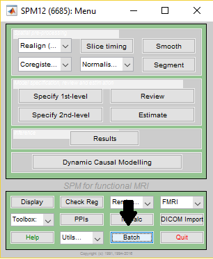
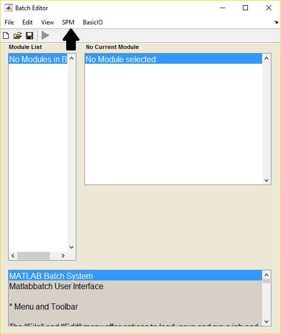
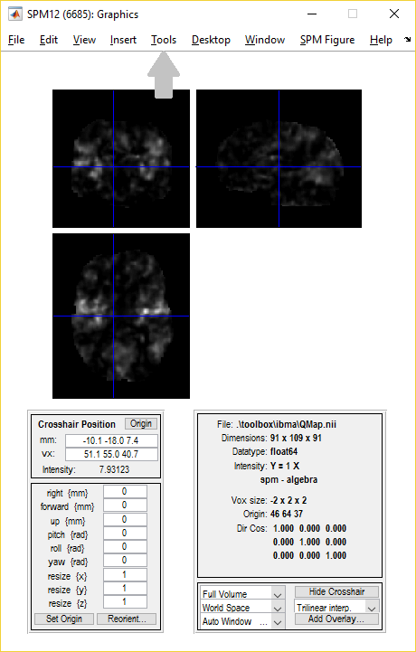

ibma
====

Image-Based Meta-Analysis toolbox for SPM.

Implementation of z-based statistics: Fisher's, Stouffer's.


# Heterogeneity toolbox

Assess Heterogeneity within meta-analysis.

##### Usage

To use the tool first open SPM in Matlab:

In the menu window select batch.

           

Then select SPM -> Tools -> Image-Based Meta-Analysis Tools -> Diagnose Heterogeneity.

 

Fill the batch with the appropriate study data (nii's must be unzipped) and select
which statistic you wish to view and run the batch with the green triangle button.

This should then create the display window showing the map. 

To perform voxel specific plots, click on the region of interest and select Tools from
the toolbar. Then select Voxel plot and select the plot of interest (either funnel, forest
or galbraith).

 

##### Requirements

- [SPM12](http://www.fil.ion.ucl.ac.uk/spm/software/spm12/)

##### Installation

To run the NIDM-Results viewer do the following:


1. Add the filepath to SPM in Matlab;

 ```
 addpath(<full path to SPM>)
 ```
 
##### Footnotes for future usage

1. Currently (as of 19/03/2017), there is a bug in the NIDM-export for SPM which means that attributes with the prefix `nidm_` inside the jsonld have an additional `:` character appended on the end. This has been fixed and should be updated in the next SPM update. However, until then, in the toolbox there is some additional code removing these colons. This code can be found in the `obtainNIDMData` code specifically in lines 26 and 181-202.

1. Presently (as of 19/03/2017), both FSL and SPM export NIDM-Results in the prov jsonld format. However, although both of these follow the same guidelines, the export for these packs is very different. The toolbox currently supports NIDM-Results packs generated by the FSL-format that contain either a single excursion set or multiple excursion sets. 
However, the toolbox only supports SPM-formatted NIDM-Results packs containing a SINGLE excursion set. This is simply as SPM only exports single contrast NIDM-Results packs currently. However, if in the future another software supports NIDM-Results export and follows the SPM NIDM export format and exports multiple contrasts, the toolbox will not be able to use the export. Currently, this is not an issue but it is something to be aware of, should more softwares adopt NIDM-Results. 

1. Presently (as of 19/03/2017), the user has to specify numerically which excursion set, within each NIDM-Results pack, they wish to use as input to the toolbox.  To ascertain which number corresponds to which excursion set the user can call the function `displayExcursionNumbers` with the path to the NIDM-Results pack of interest as input. This outputs the excursion set names and the integer corresponding to each excursion set name. Currently, the viewer just assigns the integers to excursion sets in the order in which the excursion sets were read into Matlab from the prov jsonld file inside the NIDM-Results pack. In future, it may be desirable to instead change this to a more standard ordering, perhaps alphabetically using the contrast objects IDs, as this may be difficult to replicate in other softwares.

1. There are currently (as of 19/03/2017) no check functions written for input (i.e. if the user inputs their data incorrectly there is no warning). This is not too much of a problem as inputting wrong will cause an error somewhere along the line anyway. However, it may be useful to add a more informative error in case a user enters different numbers of contrast maps and contrast standard error maps or puts in too many subject numbers.

1. Currently (as of 19/03/2017), there are tests to check both the publication bias and heterogeneity toolbox components run under a majority of use-cases. To run the tests for the heterogeneity and publication bias components simply use the `runTest_het` and `runTest_pubBias` functions respectively (note the publication bias tests are very long as they cover many use cases and thus may take some time to run).
